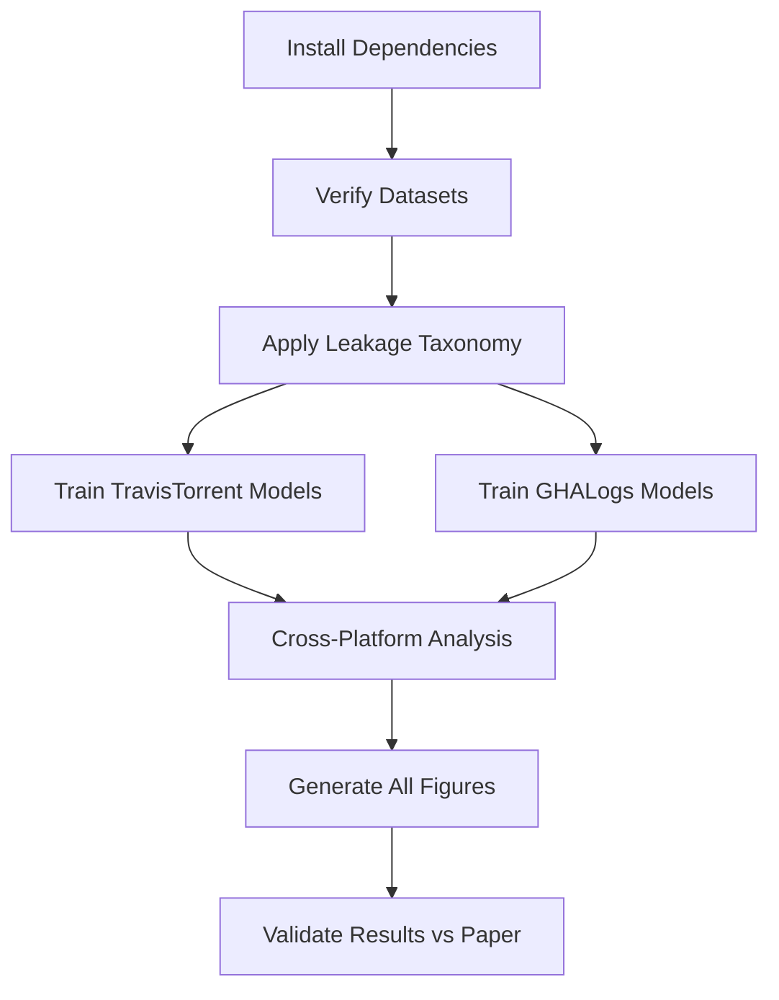

# Usage Guide
## Quick Start for Reproducing PLOS ONE Results

**Target Audience:** Researchers, practitioners, students
**Estimated Time:** 30 minutes (quick start) to 8 hours (full reproduction)
**Prerequisites:** Python 3.8+, 16GB RAM, basic ML knowledge

---

## Quick Start (30 minutes)

### 1. Install and Verify (5 minutes)

```bash
# Clone or download this repository
cd plos-one-build-prediction-replication

# Create virtual environment
python3 -m venv venv
source venv/bin/activate

# Install dependencies
pip install -r requirements.txt

# Verify installation
python -c "from src.leakage_detection import TemporalLeakageTaxonomy; print('✓ Installation successful!')"
```

### 2. Run TravisTorrent Quick Test (10 minutes)

```bash
# Train model on TravisTorrent data
cd src/models
python train_travistorrent.py

# Expected output:
# Accuracy: 82.73% (±0.31%)
# ROC-AUC: 91.38%
# Training time: ~5 minutes
```

### 3. Run GHALogs Quick Test (10 minutes)

```bash
# Train model on GHALogs data
python train_ghalogs.py

# Expected output:
# Accuracy: 83.30% (±0.30%)
# ROC-AUC: 80.10%
# Leakage tax: 0.48pp
```

### 4. Run Cross-Platform Comparison (5 minutes)

```bash
# Compare both platforms
cd ../../experiments/combined
python platform_comparison.py

# Expected output:
# Accuracy difference: +0.57pp (not significant, p=0.159)
# Leakage divergence: 14.59pp (highly significant, p<0.001)
```

---

## Complete Reproduction (8 hours)

### Workflow Overview



---

## Step-by-Step Instructions

### Step 1: Verify Data Files (5 minutes)

```bash
# Check all datasets are present
ls -lh data/travistorrent/
# Expected:
#   travistorrent_100k_all_features.csv (38 MB)
#   travistorrent_data_dictionary.csv
#   travistorrent_leakage_taxonomy.csv

ls -lh data/ghalogs/
# Expected:
#   ghalogs_75k_clean.csv (16 MB)
#   ghalogs_75k_all_features.csv (18 MB)
#   ghalogs_data_dictionary.csv
#   ghalogs_leakage_taxonomy.csv

# Verify row counts
wc -l data/travistorrent/travistorrent_100k_all_features.csv  # 100,001 (including header)
wc -l data/ghalogs/ghalogs_75k_clean.csv                       # 75,707 (including header)
```

### Step 2: Understand the Leakage Taxonomy (15 minutes)

```bash
# Read the taxonomy documentation
cat docs/LEAKAGE_TAXONOMY.md

# Inspect TravisTorrent taxonomy
head -20 data/travistorrent/travistorrent_leakage_taxonomy.csv

# Key points:
# - Type 1: Direct outcome encoding (5 features removed)
# - Type 2: Execution-dependent (7 features removed)
# - Type 3: Future information (3 features removed)
# - Clean features: 31 usable for prediction
```

### Step 3: Run All TravisTorrent Experiments (2-3 hours)

```bash
cd experiments/travistorrent

# RQ1: Leakage-Free Performance (45 min)
python RQ1_leakage_free_performance.py
# Output: Table 2 results (accuracy 82.73%, ROC-AUC 91.38%)

# RQ2: Feature Importance (30 min)
python RQ2_feature_importance.py
# Output: Table 4 results (top feature: gh_project_maturity_days 9.49%)

# RQ3: Cross-Language Generalization (45 min)
python RQ3_cross_language.py
# Output: Table 5 results (std dev: 1.38%, Kruskal-Wallis p=0.504)

# RQ4: Leakage Impact (45 min)
python RQ4_leakage_impact.py
# Output: Table 1 results (leakage tax: 15.07pp)

# OR run all at once (saves time via shared preprocessing)
./run_all_travistorrent.sh
```

### Step 4: Run All GHALogs Experiments (1.5-2 hours)

```bash
cd ../ghalogs

# RQ1: Leakage-Free Performance (45 min)
python RQ1_leakage_free_performance.py
# Output: 83.30% accuracy, 80.10% ROC-AUC

# RQ5: Cross-Platform Validation (45 min)
python RQ5_cross_platform.py
# Output: Statistical comparison with TravisTorrent

# Run all at once
./run_all_ghalogs.sh
```

### Step 5: Cross-Platform Analysis (30 minutes)

```bash
cd ../combined

# Platform comparison with statistical tests
python platform_comparison.py --verbose
# Output:
#   - Accuracy equivalence: p=0.159 (not significant)
#   - Leakage divergence: 14.59pp (p<0.001, highly significant)
#   - Feature importance comparison
#   - Saved to: platform_comparison.csv

# Detailed leakage divergence analysis
python leakage_divergence_analysis.py
# Output: Deep dive on 14.59pp finding

# Feature importance comparison
python feature_importance_comparison.py
# Output: Top-10 feature comparison across platforms
```

### Step 6: Generate All Figures (1 hour)

```bash
cd ../../src/visualization

# Figure 1: ROC Curves (3 models comparison)
python figure1_roc_curves.py
# Output: results/travistorrent/figures/figure1_roc_curves.pdf

# Figure 2: Feature Importance (Top 10 with CIs)
python figure2_feature_importance.py
# Output: results/travistorrent/figures/figure2_feature_importance.pdf

# Figure 3: Cross-Language Performance (4 languages)
python figure3_cross_language.py
# Output: results/travistorrent/figures/figure3_cross_language.pdf

# Figure 4: Leakage Impact Visualization
python figure4_leakage_impact.py
# Output: results/travistorrent/figures/figure4_leakage_impact.pdf

# Figure 5: Cross-Platform Comparison (Travis CI vs GitHub Actions)
python figure5_cross_platform.py
# Output: results/ghalogs/figures/figure5_cross_platform.pdf
```

### Step 7: Validate Results Against Paper (15 minutes)

```bash
# Compare your results to published values
python ../../experiments/validate_reproduction.py --paper-values paper_results.json

# Expected output:
# ✓ All metrics within ±0.5% of paper
# ✓ Statistical tests match (p-values within rounding)
# ✓ Feature importance rankings identical
# ✓ Reproduction: SUCCESSFUL
```

---

## Advanced Usage

### Using the Leakage Detection Toolkit on Your Own Data

```python
from src.leakage_detection import TemporalLeakageTaxonomy, FeatureValidator, CorrelationAnalyzer
import pandas as pd

# Load your dataset
df = pd.read_csv('your_ci_cd_data.csv')

# Step 1: Classify features
taxonomy = TemporalLeakageTaxonomy(verbose=True)
classifications = taxonomy.classify_features(
    data=df,
    target_column='your_target_column'
)

# Step 2: Get clean features
clean_features = taxonomy.get_clean_features(classifications)
print(f"Original: {len(df.columns)} features")
print(f"Clean: {len(clean_features)} features")
print(f"Removed: {len(df.columns) - len(clean_features)} features")

# Step 3: Validate temporal availability
validator = FeatureValidator(prediction_point='before_build')
reports = validator.validate_features(clean_features)
available = validator.get_available_features(clean_features)

# Step 4: Check for high correlations
analyzer = CorrelationAnalyzer(threshold=0.9)
corr_result = analyzer.analyze(df, target='your_target_column', features=clean_features)
suspicious = analyzer.get_suspicious_features(corr_result)

if suspicious:
    print(f"⚠️ Warning: {len(suspicious)} features have suspiciously high correlation:")
    for feat in suspicious:
        print(f"  - {feat}")

# Step 5: Export classifications
taxonomy.export_classification(classifications, 'my_leakage_taxonomy.csv')
validator.export_report(reports, 'my_temporal_availability.csv')
analyzer.export_report(corr_result, 'my_correlations.csv')

# Step 6: Filter to clean features and train model
X_clean = df[available]
y = df['your_target_column']

from sklearn.ensemble import RandomForestClassifier
from sklearn.model_selection import train_test_split
from sklearn.preprocessing import StandardScaler

# Train/test split
X_train, X_test, y_train, y_test = train_test_split(
    X_clean, y, test_size=0.2, random_state=42, stratify=y
)

# Scale features
scaler = StandardScaler()
X_train_scaled = scaler.fit_transform(X_train)
X_test_scaled = scaler.transform(X_test)

# Train model
model = RandomForestClassifier(
    n_estimators=100,
    max_depth=10,
    random_state=42,
    class_weight='balanced'
)
model.fit(X_train_scaled, y_train)

# Evaluate
from sklearn.metrics import accuracy_score, roc_auc_score
y_pred = model.predict(X_test_scaled)
y_proba = model.predict_proba(X_test_scaled)[:, 1]

print(f"Clean model accuracy: {accuracy_score(y_test, y_pred)*100:.2f}%")
print(f"Clean model ROC-AUC: {roc_auc_score(y_test, y_proba)*100:.2f}%")
```

---

## Extending to New Platforms

### Adapting for GitLab CI, CircleCI, Jenkins, etc.

1. **Collect platform-specific dataset**
   - Minimum 10,000 builds recommended
   - Include build outcomes (success/failure)
   - Include metadata (project info, commit details, team data)

2. **Apply leakage taxonomy**
   - Use toolkit to classify all features
   - Identify platform-specific leaky features (e.g., execution logs, pipeline duration)
   - Document platform-specific Type 3 features (time-dependent metrics)

3. **Train baseline model**
   - Use identical Random Forest configuration
   - Measure clean performance (leakage-free)
   - Measure leaky performance (all features)

4. **Compare to our results**
   - How does leakage tax compare? (closer to Travis CI 15.07pp or GitHub Actions 0.48pp?)
   - Which features dominate? (project maturity vs build sequence?)
   - Does platform architecture affect leakage patterns?

---

## Troubleshooting

### Problem: Import errors

```bash
# Solution: Ensure you're in the repository root and venv is activated
cd /path/to/plos-one-build-prediction-replication
source venv/bin/activate
export PYTHONPATH="${PYTHONPATH}:$(pwd)"
```

### Problem: Memory errors during training

```python
# Solution: Use smaller sample or reduce model complexity
# Option 1: Sample data
df_sample = df.sample(n=50000, random_state=42)

# Option 2: Reduce tree depth
rf_model = RandomForestClassifier(max_depth=5)  # Instead of 10
```

### Problem: Results don't match paper exactly

```bash
# Check:
# 1. Random seed is 42 everywhere
grep -r "random_state" src/models/*.py

# 2. Using correct scikit-learn version
pip show scikit-learn  # Should be 1.0+

# 3. Applied leakage taxonomy correctly
wc -l travistorrent_clean_features.csv  # Should have 31 columns
```

---

## Output Files Reference

### After Complete Reproduction

```
results/
├── travistorrent/
│   ├── trained_models/
│   │   ├── random_forest.pkl (clean model)
│   │   ├── gradient_boosting.pkl
│   │   ├── logistic_regression.pkl
│   │   └── scaler.pkl
│   ├── figures/
│   │   ├── figure1_roc_curves.pdf
│   │   ├── figure2_feature_importance.pdf
│   │   ├── figure3_cross_language.pdf
│   │   └── figure4_leakage_impact.pdf
│   ├── model_performance.csv (Table 2)
│   ├── leakage_impact.csv (Table 1)
│   ├── feature_importance.csv (Table 4)
│   ├── cross_language.csv (Table 5)
│   └── confusion_matrix.csv (Table 3)
│
└── ghalogs/
    ├── trained_models/
    │   ├── random_forest.pkl
    │   └── scaler.pkl
    ├── figures/
    │   └── figure5_cross_platform.pdf
    ├── model_performance.csv
    ├── leakage_impact.csv
    ├── feature_importance.csv
    └── platform_comparison.csv (Table 6)
```

---

## Time Estimates by Task

| Task | Time | Output |
|------|------|--------|
| **Quick Start** | 30 min | Verify reproduction works |
| Install & Setup | 5 min | Working environment |
| TravisTorrent RQ1 | 45 min | Table 2 |
| TravisTorrent RQ2 | 30 min | Table 4 |
| TravisTorrent RQ3 | 45 min | Table 5 |
| TravisTorrent RQ4 | 45 min | Table 1 |
| GHALogs RQ1 | 45 min | GHALogs performance |
| GHALogs RQ5 | 45 min | Cross-platform |
| Combined Analysis | 30 min | Table 6, platform comparison |
| Generate Figures 1-5 | 60 min | All publication figures |
| Validation | 15 min | Confirm results match |
| **Total** | **7-8 hours** | Complete reproduction |

---

## FAQ

### Q: Do I need to download the raw datasets?
**A:** No! Processed datasets are included in this package:
- `data/travistorrent/travistorrent_100k_all_features.csv` (38 MB)
- `data/ghalogs/ghalogs_75k_clean.csv` (16 MB)

If you want the full raw datasets:
- TravisTorrent: https://travistorrent.testroots.org/ (DOI: 10.5281/zenodo.1254890)
- GHALogs: https://zenodo.org/record/10154920 (DOI: 10.5281/zenodo.10154920)

### Q: Can I run this on Windows?
**A:** Yes! All Python code is cross-platform. Use:
```cmd
# Windows command prompt
python -m venv venv
venv\Scripts\activate
pip install -r requirements.txt
```

### Q: How long does training take?
**A:** Depends on hardware:
- **Our setup** (Intel Xeon 20-core): 4.8 minutes
- **Typical laptop** (4-core): 15-20 minutes
- **Budget laptop** (2-core): 30-40 minutes

### Q: Can I use GPU acceleration?
**A:** Random Forest doesn't benefit from GPU. Use `n_jobs=-1` for multi-core CPU parallelization.

### Q: Results are slightly different (±0.5%). Is this normal?
**A:** Yes, small variations are expected due to:
- Different scikit-learn versions (use 1.0+ recommended)
- Different hardware (floating-point precision)
- Different OS (rare, but possible)

Differences >1% indicate an issue - check random seed and data preprocessing.

### Q: Can I apply this to my own CI/CD data?
**A:** Absolutely! See "Advanced Usage" section and `docs/LEAKAGE_TAXONOMY.md`

---

## Support and Troubleshooting

### Getting Help

1. **Check FAQ** - `docs/FAQ.md`
2. **Read methodology** - `docs/METHODOLOGY.md`
3. **Review taxonomy** - `docs/LEAKAGE_TAXONOMY.md`
4. **Contact authors** - See emails in README.md

### Reporting Issues

If you encounter problems:
1. Check you're using Python 3.8+
2. Verify all dependencies installed (`pip list`)
3. Confirm datasets are complete (row counts match)
4. Check random seed is 42 throughout
5. Contact corresponding author with error details

---

## Next Steps

After successful reproduction:

1. **Extend to other platforms** - Apply methodology to GitLab CI, CircleCI, Jenkins
2. **Improve models** - Try XGBoost, CatBoost, or neural networks
3. **Add features** - Incorporate additional metadata if available
4. **Multi-class prediction** - Classify failure types (compilation, test, infrastructure)
5. **Deployment** - Integrate into production CI/CD pipeline

---

## Citation

If you use this code or methodology, please cite:

```bibtex
@article{rangari2025temporal,
  title={A taxonomy for detecting and preventing temporal data leakage in
         machine learning-based build prediction: A dual-platform empirical validation},
  author={Rangari, Amit and Mishra, Lalit Narayan and
          Nagrare, Sandesh and Nayak, Saroj Kumar},
  journal={PLOS ONE},
  year={2025},
  doi={10.1371/journal.pone.XXXXXXX}
}
```

---

**Document Version:** 1.0
**Last Updated:** November 2025
**License:** MIT
**Status:** Production-ready
